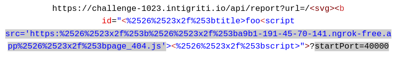

# Intigriti October 2023 XSS Challenge Writeup

## Introduction

Hey fellow hackers! 🎩💻 Ready for a wild ride into the world of XSS and hacking? In this [Intigriti's October XSS challenge](https://challenge-1023.intigriti.io/) writeup, we'll navigate through twists, turns, and a bunch of cat-related questions to reveal the precious flag! 🐱🚩 

 

Let's dive into the solution!

## The Challenge Landscape (TL;DR) 

This challenge introduces the concept of mutation XSS. The participant must inject a script into the vulnerable endpoint, initiating a chain of events that breaks out of the `<title>` tag in the browser instance of Puppeteer. The entry point was this specific endpoint: [https://challenge-1023.intigriti.io/api/report?url=/](https://challenge-1023.intigriti.io/api/report?url=/), which allowed entering a custom-encoded payload to target the browser instance. With the absence of SOP and specific security flags in check, it was possible to make the browser download and navigate to a hosted script that triggered the extraction of the remote `flag.txt` file upon access.
## Navigating the Clues: Hints from the Intigriti Twitter

Now that you've stepped into the challenge landscape, let's shed light on the hints generously shared by Intigriti through their Twitter account.

### Hint 1: Title Parsing Discrepancy

The journey begins with a text-based nugget:

> "Have you noticed any difference in title parsing between client/server?"
 
Oh, the intrigue! This hint whispered about a clandestine affair between the client and server, specifically in title parsing.

**Decoding the Hint:**
- **Client vs Server Parsing:** The title parsing (`<%- title %>`) on the server in `header.ejs` rendered a dynamic HTML version when fed with broken input. Uncover the parsing discrepancy, and you're on the brink of mutation XSS ([mXSS](https://cure53.de/fp170.pdf)) enlightenment.
- **Key Takeaway:** Despite DOMPurify filtering malicious input, you could have sent valid but broken HTML to the server and made the recipient browser fix it. By breaking out of the `</title>` tag, it was possible to inject scripts into the page as illustrated in the image above.

Now we can inject and control anything from the browser! Can't we?

### Hint 2: Chrome Developer Protocol (CDP) Link

They said, throwing us a link to the [Chrome Developer Protocol](https://chromedevtools.github.io/devtools-protocol/) (CDP):

> "Let's keep this one short and sweet..."
 
Sweet indeed! A seemingly innocent link that opened the door to a rabbit hole of possibilities!! 😱

**Decoding the Hint:**
- **CDP Exploration:** The link led us to the Chrome Developer Protocol, where understanding the APIs and how to communicate with a running Chrome seemed possible.
- **Key Takeaway:** The CDP was the key to unlocking the door. Here, you had to understand that the challenge structure made internal communication to the Chrome instance impossible, be it through WebSockets or devtools-on-devtools. A few useful things were the CDP's endpoints like `GET /json` (to check for port) and `PUT /json/new?${url}` (to open a file).

But what do we do with that information? Here comes the last hint!

### Hint 3: Meme - "Manual download" vs "Auto download"

> We'd like to apologize for the downtime, so please take this free hint 💜
> 
And then, a meme! A picture is worth a thousand words, they say. In the upper part, a man says "NO" to "Manual download," and in the bottom part, a resounding "YES" to "Auto download."

 

**Decoding the Hint:**
- **Auto-Download Revelation:** The meme hinted at the browser's ability to auto-download specific files upon opening. The trick? Serve malicious files with the header `Content-Disposition: attachment` to make the Chromium browser download them automatically regardless of the extension.
- **Key Takeaway:** Download a malicious HTML file, open it with `file://` protocol (using the second hint's discovery), and bingo! A fetch request from it could now breach the Docker instance's filesystem.

It's time to glue everything together!

## The Scripts

Get ready for the magic! Our scripts are the key to the victory flag.

### Entrypoint - [src/page_404.js](src/page_404.js)

The party starts with `page_404.js`, orchestrating the exploit dance. It cracks Puppeteer's port, initiating the auto-download of `fetcher.html` for local file extraction.

### Fetcher - [src/fetcher.html](src/fetcher.html)

Meet the fetcher, the hero fetching the flag and sending it to our local server. This script plays a crucial role in the exploit. `fetcher.html` grabs the flag and sends it to our server. A simple script with a grand mission!

### Server - [src/index.js](src/index.js)

Last but not least, our server script (`index.js`). It runs the show, coordinating the exploit and ensuring a smooth operation. Keep the server humming during the payload.

There you have it, the dynamic trio of scripts that sets up the payload! 🚀

## Decoding the Payload

Now, let's briefly dissect the exploit's payload that requires no user interaction. 

### One possible Payload

This payload targets the endpoint `https://challenge-1023.intigriti.io/api/report?url=` and utilizes two main parameters: `src` and `startPort`. 

Let's break it down:

- **Path string**: After the endpoint, the payload begins with `<svg><b id="`, introducing a closing `</title>` tag, a following `<script>` tag, a closing `>"` and a query parameter. For the payload to work, it was needed to encode any slashes present in it by HTML encoding `/` -> `&#x2f;` -> URL encoding twice -> `%2526%2523x2f%253b`.
- **Injected script**: The payload injects a script with an `src` attribute pointing to a remote server (mine was https://a9b1-191-45-70-141.ngrok-free.app) hosting the scripts. This script is our entry point into the puppeteer exploit and the flag can be visualized from that same server.
- **Query parameter**: The payload introduces the query parameter `startPort`, which typically varies between 35000 and 45000 (but in theory varies from 1 to 655355), and is used as an initial estimation of the puppeteer port at where the browsers run. The exploit involves an iterative process, maybe requiring multiple attempts to identify the correct port and extract the flag.

### Streamlining Port Extraction

I've crafted an iterative script to bring a touch of automation to the port extraction. Simply hit up `/solve`, and the script autonomously tests various ports to pinpoint the right one.

> 💡 Hint: Execute `npm i && npm start` after cloning the code to observe the script server in action.

For an in-depth dive into the magic behind automated port-guessing, check out the code documentation.

### The Flag

And as the grand finale, the flag awaits: **INTIGRITI{Pupp3t3eR_wIth0ut_S0P_LFI}**

## Conclusion 
Man, what a ride! We plunged deep into this challenge, messing with mutation XSS and puppeteer tricks. We threw in scripts, set off auto-downloads, and played around with the CDP. It's more than just hunting for a flag; it's been a crazy journey. Every clue, stumble, and "aha" moment brought us together. It's not just about the swag; it's the thrill, the joy of beating challenges and vibing with the Intigriti community. ❤️🚀

## References

1. [Intigriti October XSS Challenge](https://challenge-1023.intigriti.io/)
2. [mXSS Attacks](https://cure53.de/fp170.pdf)
2. [Chrome Developer Protocol](https://chromedevtools.github.io/devtools-protocol/)
3. [Intigriti's Discord](https://discord.com/invite/cukmQBGAKk)
4. [Intigriti's Twitter](https://twitter.com/intigriti)
